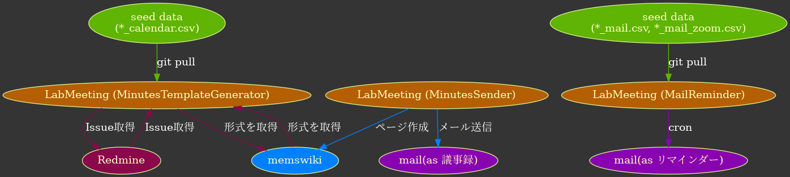

# LabMeeting

[](https://github.com/golang/go)
[](https://gitlab.p.if.t.u-tokyo.ac.jp/MitaLab/MeetingCsvGenerator/pipelines)
[](https://gitlab.p.if.t.u-tokyo.ac.jp/MitaLab/MeetingCsvGenerator/commits/master)

- 研究室のミーティング関係の自動化ツール

  1. [議事録テンプレートの生成](#1.-議事録テンプレートの生成)(MinutesTemplateGenerator)
  2. [議事録の Wiki ページ作成やメール送信](#2.-議事録の-wiki-ページ作成やメール送信)(MinutesSender)
  3. [ミーティングのメールリマインダー](#3.-ミーティングのメールリマインダー)(MailReminder)

- これは主に `golang` で書かれており，GitLab の Pipeline で 3.メールリマインダーに関しては動作している
- もし仮に GitLab が動作しなくなった場合は， タグ `1.1.1` に checkout し，mozart の `crontab` で動作させる．

  - 詳しいことは当時の `README.md` 参照

## 用語説明

### バイナリ

`バイナリ` とはダウンロード可能なバイナリのことである．

これはリリースノートのページからダウンロード可能である．
これにより，OS に依存せず実行可能である．

尚，Windowsの場合は拡張子を .exe に手動で改名すること．

### config リポジトリ

config フォルダの中身を管理しているリポジトリである．

必要なデータは以下の通り．

1. `*.csv`: `executive_mail.csv` などのミーティングの予定を書いたファイル
2. `.env`: 動作させる為の設定ファイル

(どうしても分からない場合は，本リポジトリの**CI/CD>変数**にも設定してあるので確認)

## 使用手順

- 必ず `config/.env` を作成すること

  - 今後述べるコマンドは全てこのファイルに依存して動作する
  - GitLab の Pipeline の場合は設定された環境変数が優先されるので基本的に使わない

- 必ずディレクトリ構造を保つこと

  - `congig` は勿論， `out` も

- 以下の 3 つが可能である
  1. [議事録テンプレートの生成](#1.-議事録テンプレートの生成)
  2. [議事録の Wiki ページ作成やメール送信](#2.-議事録の-wiki-ページ作成やメール送信)
  3. [ミーティングのメールリマインダー](#3.-ミーティングのメールリマインダー)

### セットアップ

<details><summary>Git が使えない場合</summary>
<div>

0. 適当なフォルダを作る ( `LabMeeting` フォルダと仮定する)
1. バイナリをリリースノートからダウンロードし， `LabMeeting` フォルダに置く
2. `config` フォルダと `out` フォルダを作成
3. `config` フォルダに `*_mail.csv`,`*_mail_zoom.csv`,`*_calendar.csv` を置く
   - 形式が分からない場合は **config リポジトリ** を参考に
   - config リポジトリからダウンロードしても可
4. `config` フォルダに `.env` を作り書く
   - 書き方の参考例は 
   - どうしても分からないものは config リポジトリを参考に
5. ./(バイナリのファイル名) で実行
   - オプションの使い方はメッセージ等を参考に
   - Linux 等の場合は実行権限を `chmod 700 (バイナリのファイル名)` で与える

</details></div>

1. 下記のコマンドで環境を用意

   ```bash
   # GitLab版
   git clone https://gitlab.p.if.t.u-tokyo.ac.jp/MitaLab/LabMeeting.git  # デフォルト
   git clone git@gitlab.p.if.t.u-tokyo.ac.jp:MitaLab/LabMeeting.git      # GitLabとSSH通信可能な人用

   # GitHub版
   git clone https://github.com/miya789/MailSystem.git # デフォルト
   git clone git@github.com:miya789/MailSystem.git     # GitHubとSSH通信可能な人用
   ```

2. 下記コマンドで `config` ディレクトリにおいて設定を読み込む

   ```bash
   cd config                                                                            # config ディレクトリに移動
   git init                                                                             # config ディレクトリを git で別管理
   git remote add origin git@gitlab.p.if.t.u-tokyo.ac.jp:MitaLab/LabMeeting_config.git  # config ディレクトリが参照する remote を設定
   git pull origin master                                                               # config ディレクトリを remote に同期
   ```

3. 適宜 `.env` の設定値を変更
   - 個人情報を含む為，これを読み込んで実行ファイルは動く
   - **自分の名前や学年を書く**
   - 既に `.env.sample` があるのでこれを参考にすること
   - 主にメールアドレス等の以下項目を変更する
     - **WIKI_TEMPLATE_MEMBERS**: メンバーが変わるので
     - **REDMINE_API_KEY**: 自分のを使わなければ卒業して失効した場合に動かない可能性あり
     - **PROXY_URL**
     - **ME_NAME_JP**
     - **ME_NAME_EN**
     - **ME_GRADE**
     - **ME_MAIL_ID**
     - **ME_MAIL_PASS**

### 普段

#### 1. 議事録テンプレートの生成

- 以下コマンドで呼び出し可能

  ```bash
  // go をインストールしている場合
  go run main.go -cmd 0

  // go をインストールしていない場合
  ./(バイナリファイル名) -cmd 0

  // 串 を挟む場合
  go run main.go -cmd 0 -p
  ```

- `-p` で `.env` に設定した串経由でアクセス可能

#### 2. 議事録の Wiki ページ作成やメール送信

- 以下コマンドで呼び出し可能

  ```bash
  // go をインストールしている場合
  go run main.go -cmd 1

  // go をインストールしていない場合
  ./(バイナリファイル名) -cmd 1
  ```

- その後の手順は対話型で誘導されるので従うこと

#### 3. ミーティングのメールリマインダー

- ミーティング内容を更新する場合は config リポジトリに，後述の **csv ファイル** を `commit` しておく

  - 形式は MeetingCsvGenerator の `README.md` も参考になる
    - 別のプログラム(MeetingCsvGenerator)で作成可能である
  - 決まった直後に行うと，忘れずにできて良い

    - <details><summary>各項目に関して詳しく</summary>
      <div>

      - 各ミーティング日程は，半角スペース区切りで `yy/mm/dd,開始時刻,場所,内容` と入力

        - `yy/mm/dd` : 日付．月と日それぞれ 2 文字ずつ(0 埋め)入力
          - e.g.) 2020/03/07、2020/12/05、2020/10/14
        - `開始時刻` : そのまま:区切りで入力
          - e.g. 10:00、09:30
        - `場所` : 基本的には以下の候補いずれかを「そのまま」使用
          - `113` `114` `128` `VDEC306` `VDEC402` `Bldg13`
            - 英語表記と日本語表記の文字列を生成する為のキーワード
            - `Zoom` の場合は自動で外部ファイル `executive_mail_zoom.csv` を読み込む
            - これ以外の文字列の場合，書いたものがそのまま日本語でも英語でも使われるが， [pkg/lab_mail/meeting_place.go](pkg/lab_mail/meeting_place.go) の該当箇所を加筆すれば同様に使用可能
        - `内容` : 内容

      - 例: `Executive meeting` の場合

        - `executive_mail.csv`

          ```csv:executive_mail.csv
          Start Date,Start Time,Location,Subject
          2021/03/01,10:00,114,Executive meeting
          2021/03/08,10:00,Zoom,Executive meeting
          ```

        - `executive_mail_zoom.csv`
          ```csv:executive_mail_zoom.csv
          Start Date,Start Time,URL,Password
          2021/03/08,10:00,https://zoom.us/j/<ID>?pwd=<ENCODED_PASS>,<PASS>
          ```

      </details></div>

- こうすることで，config リポジトリの内容に従い，後は勝手に GitLab の `schedules` ステージの Pipeline が勝手にやってくれる

  - (どうしても場所が分からない場合は，後述の環境変数にも設定してあるので確認)
  - 尚，送信に失敗した場合は GitLab の `schedules` ステージの Pipeline を確認すること
    - その際は自分でメールを書いて送信して対処

  - 設定を変える場合は， **CI/CD>変数** を変える

    - `MAIL_REMINDER_ACCESS_TOKEN` は `GitLab-Runner` アカウントのアクセストークンである
      - これを用いて config リポジトリを clone しているので，**間違って削除しないように注意すること**

  - 普段は使わないが，以下コマンドで呼び出し可能

    ```bash
    // go をインストールしている場合
    go run main.go -cmd 2 -mtg (1もしくは2)

    // go をインストールしていない場合(恐らくその場合は使わない)
    ./(バイナリファイル名) -cmd 2 -mtg (1もしくは2)
    ```

### 引継ぎ後

- 特に無い
- ミーティングの予定を決まった形式で， config リポジトリ( **remote** )に `commit` さえおけば問題無い筈……

## ファイル構成

- (・)は Git 管理外
- 尚，主に `main.go` -> `lab_cmd/*.go` -> `pkg/*` の順で呼ばれている

```bash
.
├── README.md
├── config
│   ├── (.env)
│   ├── .env.sample
│   ├── (.gitignore)
│   ├── (executive_calendar.csv)
│   ├── (executive_mail.csv)
│   ├── (executive_mail_zoom.csv)
│   ├── (teamMEMS_calendar.csv)
│   ├── (teamMEMS_mail.csv)
│   └── (teamMEMS_mail_zoom.csv)
├── doc
│   └── img
│       ├── diagram.dot
│       └── diagram.pdf
├── go.mod
├── go.sum
├── lab_cmd (実行ファイルに呼ばれる3種類のコマンドファイル)
│   ├── mail_reminder.go
│   ├── minutes.go
│   └── send_minutes.go
├── main.go (実行ファイル)
├── out
└── pkg (各機能毎に分けたパッケージ類)
    ├── lab_flag
    │   ├── flag.go
    │   └── flag_test.go
    ├── lab_mail
    │   ├── address.go
    │   ├── meeting_place.go
    │   ├── meeting_place_test.go
    │   ├── message.go
    │   └── send_mail.go
    ├── meeting_type
    │   └── meeting_type.go
    ├── memswiki
    │   ├── digest.go
    │   └── memswiki.go
    ├── redmine
    │   └── redmine.go
    └── schedule
        ├── config.go
        ├── read.go
        ├── weekday.go
        └── weekday_test.go
```

## 主な流れ


